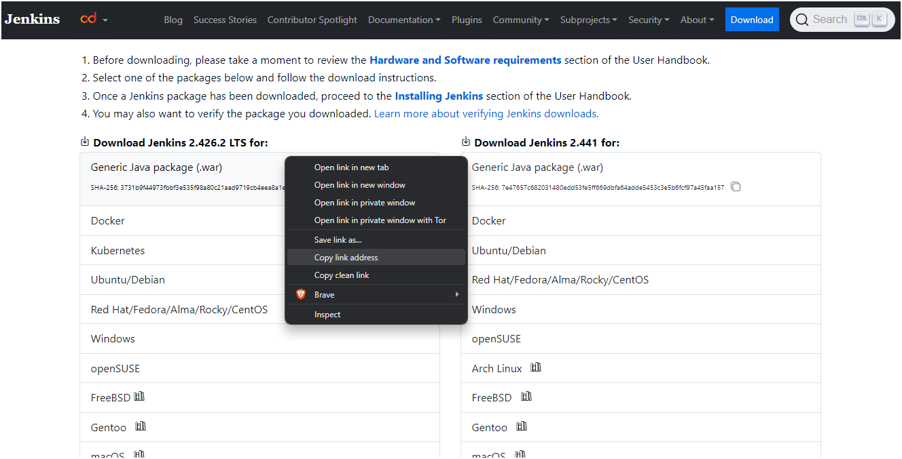
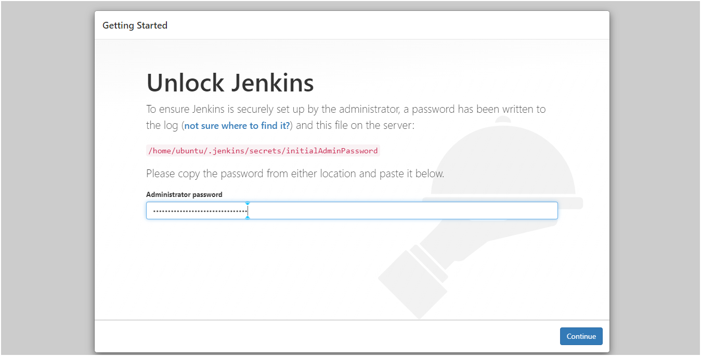
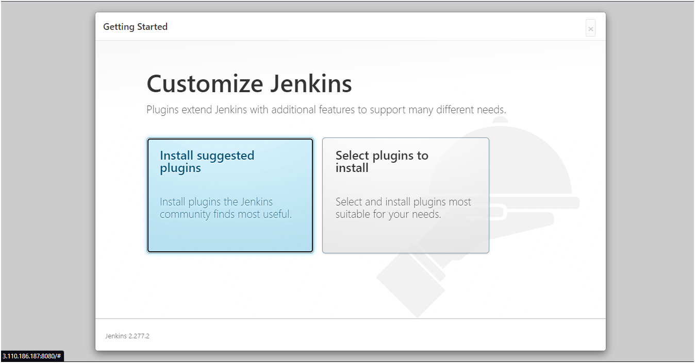

# Jenkins Project for DevOps.
### In this project, we will learn about how jenkins works:

### Tools Covered:
-  Aws Instance
-  Linux / Ubuntu
-  Git Bash
-  Java 
-  Git
-  Maven
-  Jenkins

#

-  AWS instance (Ubuntu) with instance type t2.micro and root volume 8GB and download the keypair in your local machine.
-  Go to the folder where you have place your key then Open GITBASH in local machine and enter your ssh the git bash automatically connects to the instance.
#
-  update the repository

    ```bash
        sudo apt-get update
    ```
-  download the latest version of java and check the version

    ```bash
        sudo apt-get install openjdk-11-jdk -y
        java -version
   ```
-  install git and maven and check version

   ```bash
        sudo apt-get install -y git maven 
        git --version 
        mvn --version
   ```
-  Download & install Jenkins - Reference: <b><a href="https://www.jenkins.io/download/"><u> Jenkins installation </a></u></b>

   ```bash
        wget  https://get.jenkins.io/war-stable/2.277.2/jenkins.war
   ```
     <br />
<p align="center">
    
  </a>
  
-  start the jenkins
  
   ```bash
        java -jar jenkins.war
   ```
-  When we are installing jenkins it will automatically give you    the password in the github terminal.
-  Copy the public ip of the dev server and paste the ip address in the browser and in the end enter :8080 with the default port number.
-  unlock the jenkins
      <br />
<p align="center">
    
  </a>
  
-  Press Install Suggested Plugins
      <br />
  <p align="center">
      
    </a>
    
-  The first user which we create here is the admin user of the jenkins.
-  Click on save and continue.
#
##Create Sample Job

-  Build tab
-  Click on execute Shell
-  In Command Box Enter echo " Hello Jenkins"
-  Click on Console Output


